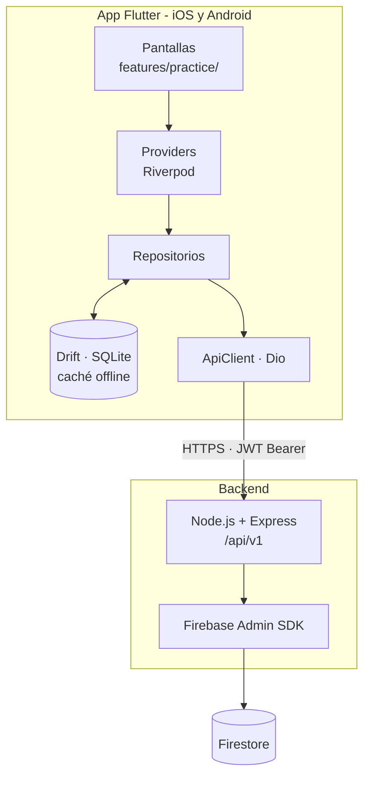

# Módulo de Preguntas — App Aprueba

> Núcleo de práctica de la aplicación móvil de **Aprueba**, plataforma de preparación para exámenes de admisión universitaria (PAES).

Proyecto de Título (Capstone) · Grupo 9 · Duoc UC San Bernardo · 2026


---

## Tabla de contenidos

- [Descripción](#descripción)
- [Alcance](#alcance)
- [Tecnologías](#tecnologías)
- [Arquitectura](#arquitectura)
- [Instalación y ejecución](#instalación-y-ejecución)
- [Estructura del repositorio](#estructura-del-repositorio)
- [Metodología de trabajo](#metodología-de-trabajo)
- [Convenciones](#convenciones)
- [Equipo](#equipo)

---

## Descripción

Aprueba es una plataforma freemium de práctica intensiva para estudiantes que rinden exámenes estandarizados de admisión universitaria, con mercado inicial en Chile y expansión proyectada al Reino Unido. Su modelo entrega un flujo diario de preguntas desde un banco central, con desbloqueo progresivo a cambio de datos del estudiante y suscripciones de bajo costo.

Este repositorio contiene el **módulo de preguntas**: el ciclo funcional donde el estudiante recibe una pregunta, la responde contra reloj, conoce su resultado comparado con la cohorte, accede a la explicación paso a paso y a la habilidad evaluada, gestiona su cuota diaria y puede solicitar la recorrección de una pregunta que considere errónea.

Es el núcleo de valor del producto: sin él, la aplicación no cumple su propósito.

---

## Alcance

### Incluido

**Seis pantallas** en el cliente móvil:

| Pantalla | Función |
|---|---|
| Pregunta | Enunciado y alternativas, cronómetro, descuento de cuota |
| Resultado | Acierto o error, alternativa correcta, explicación breve, percentil de velocidad, medalla obtenida |
| Explicación detallada | Planteamiento, pasos intermedios, verificación y concepto clave |
| Habilidad | Habilidad evaluada, nivel de dominio, árbol de prerrequisitos y recursos recomendados |
| Recorrección | Solicitud de revisión con motivo tipificado y comentario |
| Desbloqueo de cuota | Ampliación de la cuota diaria declarando colegio o región |

**Trece endpoints** en el backend:

```
Práctica       GET  /practice/next
               GET  /questions/{id}
               POST /questions/{id}/answer
               GET  /questions/{id}/explanation
               GET  /questions/{id}/skill

Cuota          GET  /me/quota
               POST /me/quota/unlock

Recorrección   POST /corrections
               GET  /corrections

Configuración  GET  /tests
               GET  /me/preferences
               PUT  /me/preferences
               GET  /me/progress
```

### No incluido

Registro y autenticación, onboarding, pantalla de inicio, sistema de medallas y canjes, grupos de estudio, comunidad, marketplace de tutores, muro de pago y suscripciones, ajustes y notificaciones. Tampoco la consola de administración, el generador de preguntas, el sitio web del alumno ni la landing de marketing.

---

## Tecnologías

### Cliente móvil

| Componente | Tecnología | Rol |
|---|---|---|
| Framework | Flutter 3.22+ / Dart 3.3+ | Un solo código para iOS y Android |
| Estado | Riverpod | Gestión de estado reactiva y testeable |
| Navegación | GoRouter | Enrutamiento declarativo |
| Red | Dio | Cliente HTTP con interceptor de renovación de tokens |
| Persistencia local | Drift (SQLite) | Caché para repaso sin conexión |
| Almacenamiento seguro | flutter_secure_storage | Custodia del refresh token |

### Backend

| Componente | Tecnología | Rol |
|---|---|---|
| Runtime | Node.js | Entorno de ejecución |
| Framework | Express | API REST bajo `/api/v1` |
| Base de datos | Firestore (Firebase Admin SDK) | Persistencia, con emulador para desarrollo local |
| Autenticación | JWT | Access token de 15 min + refresh de 30 días con rotación |

### Justificación de las decisiones principales

- **Flutter** permite mantener un único código fuente para ambas plataformas móviles, algo determinante para un equipo de tres personas con plazo acotado.
- **Riverpod** ofrece inyección de dependencias y estado testeable sin acoplar la lógica al árbol de widgets, lo que facilita aplicar desarrollo guiado por pruebas.
- **Drift** habilita el repaso sin conexión, requisito funcional del producto, con consultas tipadas y verificadas en tiempo de compilación.
- **Firestore** es la base de datos ya adoptada por el ecosistema; mantenerla evita divergencias en el modelo de datos.

---

## Arquitectura



### Flujo de datos

La interfaz nunca conversa directamente con la red. Toda petición atraviesa la cadena `UI → provider → repositorio → ApiClient`. En cada lectura el repositorio escribe el resultado en la caché local y, ante un fallo de red, intenta servir la última copia disponible.

### Manejo de sesión

El access token viaja en la cabecera `Authorization`. Ante una respuesta 401, el interceptor de Dio renueva las credenciales con el refresh token —que rota en cada uso— y reintenta la petición original de forma transparente. Si la renovación falla, la sesión se marca como cerrada y el router redirige al inicio.

### Contrato de respuestas

Todas las respuestas de la API comparten una estructura común:

```json
{
  "data":  { },
  "error": null,
  "meta":  { "requestId": "...", "timestamp": "..." }
}
```

En caso de error, `data` es `null` y `error` contiene `code` (identificador estable, legible por máquina), `message` (texto listo para mostrar), `details` y `field`.

Una decisión de diseño relevante: **los códigos de error de negocio se traducen a estados de interfaz, no a mensajes genéricos**. Alcanzar la cuota base conduce a la pantalla de desbloqueo; no produce un error.

---


## Metodología de trabajo

El proyecto adopta un **enfoque híbrido**: Scrum como marco de gestión y Extreme Programming como conjunto de prácticas de ingeniería.

La combinación responde a dos necesidades distintas. Scrum aporta la estructura, la cadencia de entrega y las instancias de inspección y adaptación. XP aporta las prácticas técnicas que sostienen la calidad del código en un equipo que aprende un lenguaje y un framework nuevos durante el mismo período en que debe entregar.

### Scrum

Sprints de una semana, con Product Backlog derivado de las seis pantallas y los trece servicios. Cada sprint cierra con una demostración del incremento funcional y una retrospectiva del proceso.

### Extreme Programming

| Práctica | Aplicación |
|---|---|
| Programación en pares | Acelera el aprendizaje del framework y difunde el conocimiento |
| Desarrollo guiado por pruebas | Las reglas de cuota, recompensas y recorrección se fijan como pruebas antes de implementarse |
| Integración continua | Cliente y backend se integran de forma permanente |
| Refactorización continua | El diseño mejora a medida que el equipo domina el framework |
| Diseño simple | Contiene el alcance técnico dentro del plazo disponible |
| Estándares de código | Uniformidad mediante el analizador estático del proyecto |
| Propiedad colectiva | Ningún componente depende de una sola persona |
| Ritmo sostenible | Carga de trabajo compatible con la disponibilidad del equipo |

**Desviación declarada.** Extreme Programming contempla la presencia permanente del cliente durante el desarrollo. Esta práctica no se cumple, dado que la contraparte no participa del trabajo diario. La mitigación adoptada consiste en registrar formalmente cada decisión tomada sin confirmación —con su supuesto, su fuente y su impacto potencial— en un registro que se revisa a lo largo del proyecto.

---

## Convenciones

### Definition of Done

Una tarea se considera terminada cuando:

- El código fue revisado por al menos otro integrante
- Se cumplen los criterios de aceptación definidos
- Las pruebas unitarias están escritas y pasan
- `flutter analyze` no arroja advertencias
- Se respeta el contrato de respuestas y el catálogo de errores
- Los errores de negocio se traducen a estados de interfaz comprensibles
- La respuesta correcta de una pregunta nunca se expone antes de que el estudiante responda
- No hay credenciales ni secretos versionados

### Control de versiones

- Rama principal: `main`
- Ramas de trabajo: `feature/<descripción-breve>`
- Integración a `main` de forma frecuente, con revisión previa de al menos un integrante

---

## Equipo

| Integrante | Rol | Responsabilidad principal |
|---|---|---|
| Martín Alonso Espinoza Morales | Scrum Master · Full-stack | Gestión del proceso, documentación y apoyo transversal |
| Jeremías Danielo Fernández Millacura | Backend | Servicios, modelo de datos y lógica de negocio |
| Sebastián Roberto Acevedo Araya | Frontend móvil | Pantallas y capa de presentación |

La propiedad colectiva del código implica que estos roles indican responsabilidad principal, no exclusividad.

**Profesora guía:** Eliana Mallen González
**Empresa contraparte:** Aprueba

---

## Contexto académico

Este repositorio corresponde al Proyecto de Título de la asignatura **PTY4614 Capstone**, sección CAPSTONE_002D, de la carrera de Ingeniería en Informática de **Duoc UC, sede San Bernardo**, durante el segundo semestre de 2026.

El desarrollo se organiza en tres fases: definición del proyecto, desarrollo del producto y presentación ante la comisión evaluadora.
